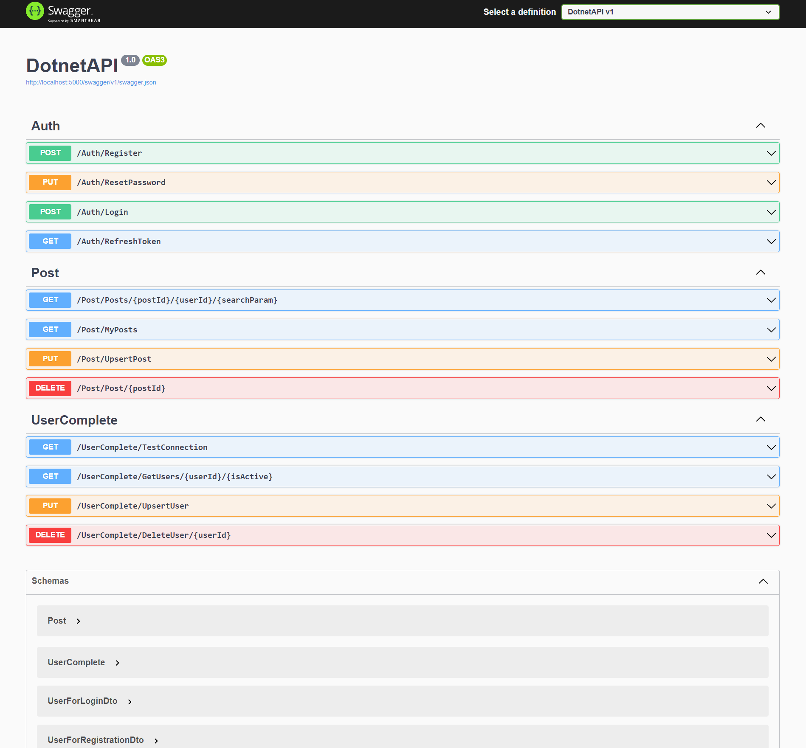

# DotNetApi

## Project Description

This REST API, built with C# and .NET Core, can be used to manage users and posts in an organization. 

### Feature overview

Here's a glimpse of the Api, running on Swagger UI


_Dashboard of the application_

## Run the Project

Once the dependencies are installed, you can run the project using Vite:

```bash
dotnet run
# or
dotnet watch run
```
The application will start and by default can be accessed at http://localhost:5000/.

## Contact Me

If you have questions or wish to discuss the project further, don't hesitate to reach out:

- **Email:** [wenziyang007@gmail.com](mailto:wenziyang007@gmail.com)

I'm always open to feedback, collaboration, or general inquiries. Looking forward to hearing from you!
