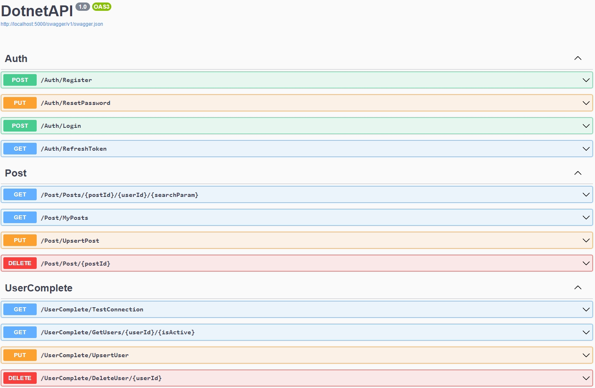

# DotNetApi

## Project Description

Deployed on [dtcodeapi2.azurewebsites.net](dtcodeapi2.azurewebsites.net), this REST API, built with C# and .NET Core, can be used as a forum to manage users and posts in an organization. 

### Feature overview

Here's a glimpse of the Api, running on Swagger UI



### Authentication (AuthController):

Register: New user registration with email and password validation.

ResetPassword: Allows users to update their password.

Login: User login with email and password; provides authentication token.

RefreshToken: Generates a new authentication token for logged-in users.

### Post Management (PostController):

GetPosts: Retrieves posts with optional filters for post ID, user ID, and search terms.

MyPosts: Fetches posts created by the authenticated user.

UpsertPost: Creates a new or updates an existing post.

DeletePost: Deletes a post by its ID.

### User Management (UserCompleteController):

TestConnection: Checks database connectivity.

GetUsers: Retrieves users based on ID and active status.

UpsertUser: Creates or updates user information.

DeleteUser: Removes a user record by ID.

## Run the Project

Once the dependencies are installed, you can run the project using Vite:

```bash
dotnet run
# or
dotnet watch run
```
The application will start and by default can be accessed at http://localhost:5000/.

## Contact Me

If you have questions or wish to discuss the project further, don't hesitate to reach out:

- **Email:** [wenziyang007@gmail.com](mailto:wenziyang007@gmail.com)

I'm always open to feedback, collaboration, or general inquiries. Looking forward to hearing from you!
